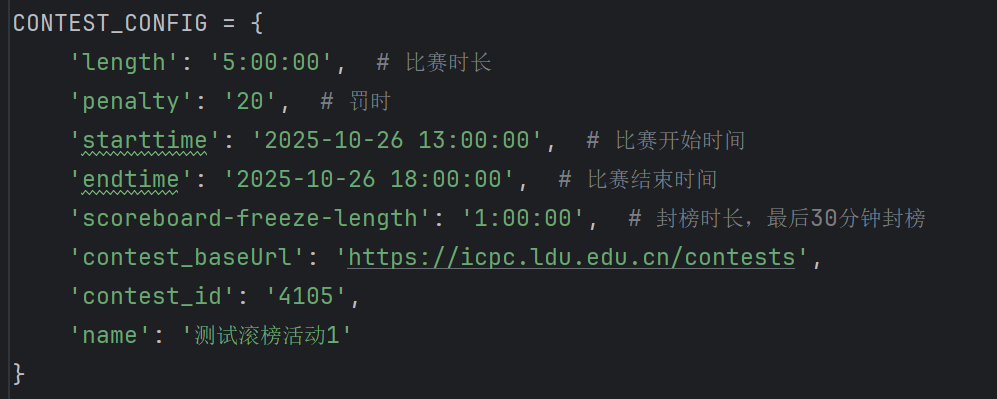
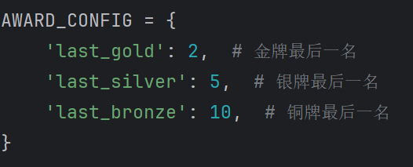
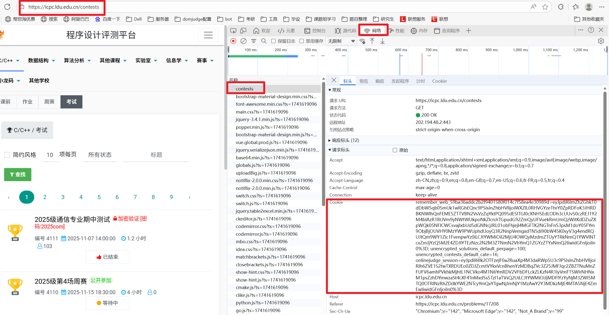
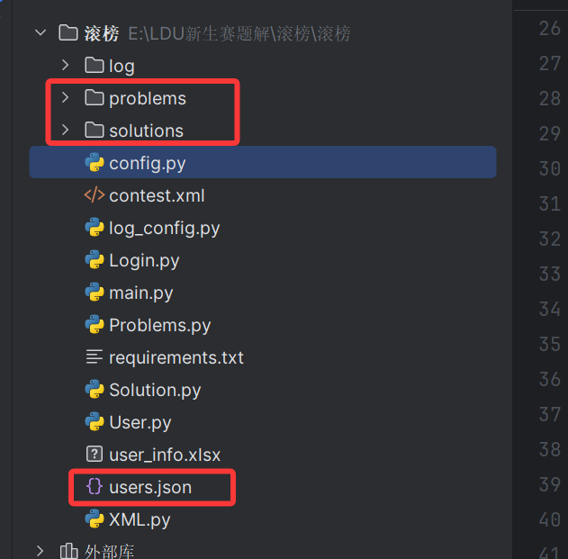
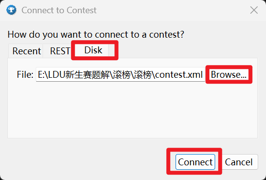
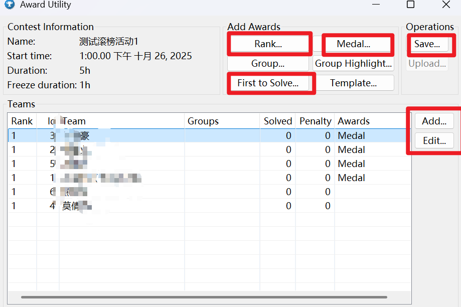
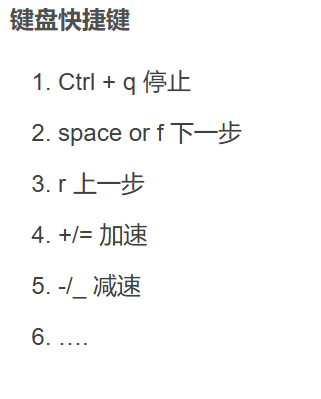

# 滚榜程序使用说明

> # 环境需要
>
> 1. 需要配置 python 环境以运行脚本程序获取提交数据
> 2. 需要 lduoj 的管理员账号权限以获取提交数据
> 3. 需要 java 环境以运行滚榜程序
> 4. 下载 git 使用 git bash

## 设置用户

在user_info.xlsx中添加用户的信息（该部分用户是参与滚榜的用户）

## 完成信息配置

### 配置比赛的信息

在config中，设置正确的信息



```
length: 比赛的时长
penalty: 罚时时长（分钟）正常都是20
starttime: 比赛的开始时间，一定要设置正确，爬虫获取提交记录仅获取比赛开始和结束时间内的记录
endtime: 比赛的结束时间，一定要正确设置
scoreboard-freeze-length: 封榜时长，图中注释应该是最后1小时封榜
contest_baseUrl: 这一部分无需修改，除非oj平台更换域名
contest_id: 比赛的id，平台中比赛的id
name: 请正确设置，滚榜时间时会显示此名称
```



奖牌的最后一名，发现暂时没有起作用

### 配置爬虫登录

**COOKIE**: 这部分需要管理员正好登陆后复制cookie粘贴到此处，模拟登录。

使用f12打开网络，清空请求，然后刷新这个url的请求，找到contest，复制其中的cookie。需要加引号作为字符串。



## 运行

直接在main.py中运行，生成xml文件

> <font color='red'>注意: 运行前请删除prolem，solution，user等文件，不删除会有缓存直接从源文件中读取，导致结果错误</font>
>
> 

## 滚榜设置

<font color='red'>滚榜需要首先配置 JAVA 环境</font>

首先点击 awards.bat 等待一会进行奖项滚榜的设置

注：如果一次没有弹出白框稍等一会就行。



在第三个中选择刚才代码生成的xml文件。connect

### 设置滚榜



> Rank: 就是排名，可以在滚榜时间设置暂停显示排名
>
> Medal: 设置奖项的数量（这里一定要设置，之前那个设置不起作用，暂未解决）
>
> First to Solve: 设置一血奖项
>
> Add/Edit: 可以针对某个人进行奖项的添加，删除，自定义

`sava` 保存成 `contest.json`，<font color='red'>一定要加后缀</font>

### 开始滚榜

<font color='red'>滚榜的脚本需要 bash 环境，可以使用git bash。百度的下载</font>

将刚才生成的 `json` 文件放置到 `resolve` 的 `cdp` 文件夹下

在resolve文件夹下打开 `git bash` 中运行命令`./resolver.bat ./cdp/contest.json` 稍等一会就可以开始滚榜了



